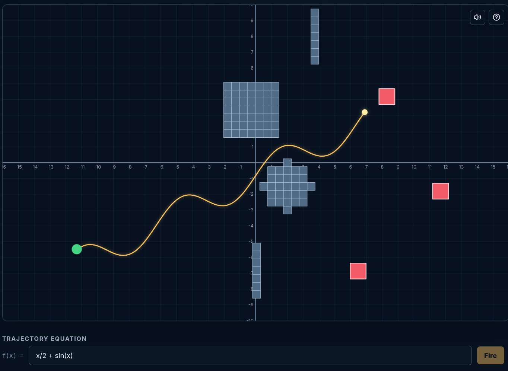

# MathWar

[](https://github.com/Swellshinider/MathWar/actions/workflows/ci.yml)

MathWar is an open-source project for browser-based math mini-games. Have fun playing!

## Available Mini-Games

### Equation Artillery

Equation Artillery is a graph-based artillery game inspired by
[Graphwar](https://github.com/catabriga/graphwar). Players type equations, fire shots
that follow the resulting curve, and use function shape to hit targets, walls, CPU
soldiers, or private multiplayer opponents.



Current modes:

- Target Practice
- Free Practice
- CPU vs.
- Private 1v1 multiplayer

### Formula Frenzy

Formula Frenzy is a progression-based arithmetic sprint with an untimed Free Practice
mode for drilling selected operation types. Solve each formula before its timer expires,
keep your streak alive, and watch the problems get harder as your score climbs.

## Requirements

- Node.js `22.22.3` or newer
- npm `11` or newer

## Install and Run

```bash
npm ci
npm start
```

Open the local URL printed by the Angular development server. The game catalog is served
at `/`.

## Development Commands

```bash
npm run build
npm run build:production
npm run test:server
npm test -- --watch=false
```

`npm run test:server` builds the shared engine first, then runs the Fastify and
game-engine test suite with Vitest.

## Multiplayer Development

The multiplayer implementation has three parts:

- `packages/game-engine`: deterministic simulation shared by browser and server
- `server`: Fastify and Socket.IO authoritative server with PostgreSQL persistence
- `src/app/games/equation-artillery/multiplayer`: Angular lobby and match client

Copy `public/config.example.js` to `public/config.js`, then set `serverUrl` to the
origin of the Fastify server. For a no-database local match server, use:

```js
window.MATH_WAR_CONFIG = {
  serverUrl: 'http://127.0.0.1:3000',
};
```

Then run the in-memory server and Angular dev server together:

```bash
npm run dev:local
```

You can still run them in separate terminals when you need independent logs:

```bash
npm run server:dev:memory
npm start -- --host 127.0.0.1
```

Use `server/.env.example` as the template for local production-like server variables.

```bash
npm run server:dev
npm start
```

The server applies SQL files from `server/db/migrations` into PostgreSQL on startup and then
checks that the multiplayer tables exist. `DATABASE_URL`, `SESSION_SECRET`, and
`CLIENT_ORIGIN` are mandatory. The browser receives only `serverUrl` through
`/config.js`.

## Project Layout

- `src/app`: Angular application, routes, shared shell, and game UI
- `packages/game-engine`: shared deterministic simulation code
- `server`: Fastify and Socket.IO multiplayer server
- `server/db/migrations`: PostgreSQL schema migrations
- `docs`: architecture notes and changelog
- `public`: static browser assets and runtime config example

## License

MathWar is licensed under GPL-3.0-only. See [LICENSE](LICENSE).
