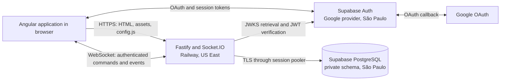

# Math War Architecture

## System overview

Math War is an Angular 22 single-page application with two Equation Artillery modes:

- The local game runs entirely in the browser.
- The private multiplayer game uses Google authentication, an authoritative Fastify and Socket.IO
  server, and PostgreSQL persistence.

Production packages the Angular application and Fastify server into one Railway service. Fastify
serves the browser bundle, exposes runtime browser configuration, handles Socket.IO connections,
and connects to the existing Supabase project for identity verification and match persistence.



The Railway service uses one production replica. Socket membership, connected-user tracking, and
disconnect timing are process-local, so additional replicas would require a shared Socket.IO
adapter and shared presence coordination.

## Repository layout

| Path                                            | Responsibility                                                                                                   |
| ----------------------------------------------- | ---------------------------------------------------------------------------------------------------------------- |
| `src/app/`                                      | Angular application shell, routes, local game, multiplayer UI, and browser services                              |
| `src/app/games/equation-artillery/game/`        | Local-game parsing, spawning, animation, collision, coordinates, and rendering support                           |
| `src/app/games/equation-artillery/multiplayer/` | Supabase session handling, Socket.IO client, lobby, and multiplayer presentation                                 |
| `packages/game-engine/`                         | Framework-independent multiplayer types, safe expression parser, seeded generation, and authoritative simulation |
| `server/src/`                                   | Fastify bootstrap, JWT verification, Socket.IO protocol, and repository implementations                          |
| `supabase/migrations/`                          | Versioned production database schema                                                                             |
| `public/`                                       | Static browser assets and the local runtime-configuration example                                                |
| `railway.json`                                  | Production build, start, health check, replica, and region configuration                                         |
| `docs/`                                         | Changelog and architecture documentation                                                                         |

Tests are colocated with the code they cover as `*.spec.ts`. Server tests use the in-memory
repository, real Fastify injection, and real Socket.IO clients.

## Build and runtime topology

The root npm workspace includes `packages/game-engine`. The production build runs:

1. `npm ci`
2. `npm run build:production`
3. `npm run build`, which compiles the shared engine and Angular application
4. `npm run server:build`, which compiles the shared engine and Fastify server

Angular writes its browser output to `dist/math-war/browser`. TypeScript writes the server output
to `server/dist`. Railway starts `node server/dist/main.js` through `npm run server:start`.

`server/src/main.ts` validates all required variables before creating the service:

| Variable                   | Used by                                      | Exposure                                 |
| -------------------------- | -------------------------------------------- | ---------------------------------------- |
| `DATABASE_URL`             | Server PostgreSQL pool                       | Server only; Supabase session-pooler URI |
| `SUPABASE_URL`             | Browser Auth client and server JWKS verifier | Public                                   |
| `SUPABASE_PUBLISHABLE_KEY` | Browser Auth client                          | Public by design                         |
| `CLIENT_ORIGIN`            | CORS policy and browser `serverUrl`          | Public                                   |
| `PORT`                     | Fastify listener                             | Railway-provided runtime value           |
| `NODE_ENV`                 | Logging and production runtime behavior      | Server only                              |

Production runs one replica in Railway's US East region. Supabase remains in São Paulo, so all
database operations cross regions. This is an accepted latency tradeoff for the initial release.

## HTTP and static application delivery

Fastify owns the public HTTPS origin and serves these request classes:

| Request                                | Behavior                                                                    |
| -------------------------------------- | --------------------------------------------------------------------------- |
| `GET /health`                          | Returns `{ "status": "ok" }` for Railway health checks                      |
| `GET /config.js`                       | Generates browser-safe runtime configuration with `Cache-Control: no-store` |
| Angular bundle and assets              | Served from `dist/math-war/browser` by `@fastify/static`                    |
| Browser route with `Accept: text/html` | Falls back to `index.html` for Angular routing                              |
| Unknown non-HTML route                 | Returns a JSON 404 response                                                 |
| `/socket.io/*`                         | Handled by Socket.IO on Fastify's HTTP server                               |

`config.js` contains only `serverUrl`, `supabaseUrl`, and `supabasePublishableKey`. Its values are
serialized at runtime, and less-than signs are escaped before producing JavaScript. The static-file
plugin explicitly excludes `config.js`, preventing a local development file from overriding or
colliding with the runtime route.

For local Angular development, copy `public/config.example.js` to `public/config.js` and provide
local public values. `public/config.js` is gitignored and is not part of the production source.

## Angular application

### Application shell and routes

The Angular application uses standalone components and lazy-loaded routes:

- `/` loads the game catalog.
- `/games/equation-artillery` loads the local game.
- `/games/equation-artillery/multiplayer` loads the authenticated multiplayer game.
- Unknown browser routes redirect to the catalog after Angular starts.

The reusable application shell and `GameFrameComponent` provide common layout around game-specific
components.

### Local Equation Artillery

The local mode has no server dependency and does not persist state. The page component coordinates
signals for the player, targets, walls, shot trail, bullet, current equation, and equation history.

The local game is divided into focused modules:

- Expression parsing accepts only the documented symbols, operators, constants, and functions.
- Spawning creates randomized players, targets, and walls.
- Trajectory logic advances a shot in fixed steps and resolves collisions.
- `AnimationService` drives browser animation independently of game rules.
- `BoardRenderer` converts world coordinates to canvas coordinates and draws the scene.
- Components own presentation, form state, help, history, and previews.

This mode intentionally has a separate implementation from multiplayer. Local play remains
available without authentication or network connectivity.

### Multiplayer presentation and session handling

`MultiplayerAuthService` constructs a Supabase browser client from runtime public configuration. It
restores the current session, observes Auth state changes, starts Google OAuth, and signs users out.
OAuth redirects back to the exact multiplayer route.

When an access token becomes available, `MultiplayerPageComponent` asks
`MultiplayerSocketService` to open an authenticated WebSocket connection. When the token disappears,
the socket disconnects and browser match state is cleared.

The page stores server-provided `MatchState` in an Angular signal. Computed signals derive the local
player, opponent, turn ownership, targets, equation history, and status text. Shot results contain
an authoritative trail, which the browser animates without recalculating game outcomes. While a
shot is animated, newer authoritative states are buffered so wall damage, turn ownership, history,
and match results appear only when the trail reaches its impact.

## Shared multiplayer engine

`@math-war/game-engine` is a TypeScript workspace package imported by both the browser and server.
It contains no Angular, Fastify, database, or transport code.

Its public contract includes:

- Match, player, wall, command, acknowledgement, and event types
- Safe expression normalization and compilation
- Seeded random generation
- Match creation and authoritative shot resolution

The expression parser normalizes supported Unicode characters and implicit multiplication, builds
a MathJS abstract syntax tree, and rejects unsupported nodes, symbols, operators, and multi-argument
functions. Expressions are limited to 180 normalized characters, and every evaluated result must be
a finite number.

Multiplayer boards are deterministic from the persisted match seed. A shot advances in fixed world
steps, tests bounds, opponent collision, and wall collision, then returns the complete trail and
next state. Valid equations are appended to the persisted history with their command and shooter
IDs. Invalid expressions leave match state and history unchanged. A successful opponent hit ends
the match; otherwise the turn moves to the opponent.

The browser imports event and state types for rendering. The server is the only caller trusted to
apply simulation results to persistent state.

## Fastify and Socket.IO server

### Startup lifecycle

At startup, the server:

1. Validates required environment variables.
2. Creates a PostgreSQL repository and Supabase JWT verifier.
3. Registers CORS, health, runtime configuration, static assets, and SPA fallback behavior.
4. Attaches Socket.IO to the Fastify HTTP server.
5. Checks that both required private-schema tables exist.
6. Starts the reconnect-expiration and finished-match cleanup interval.
7. Listens on Railway's `PORT` and all network interfaces.

Startup does not create or modify tables. Missing schema causes a fail-fast startup error, keeping
database changes in versioned Supabase migrations.

### Authentication

The browser sends its Supabase access token in the Socket.IO handshake. The server verifies the JWT
against Supabase's remote JWKS endpoint and requires the configured Supabase issuer. The JWT subject
becomes the stable player ID.

Google profile metadata or email is used only to create a display name. It is not used for
authorization. Authorization decisions use the verified subject and current persisted match state.
Missing or invalid tokens are rejected before the Socket.IO connection is accepted.

### Command protocol

Every state-changing command contains:

- `commandId`, a client-generated UUID used for idempotency
- `expectedVersion`, the match version last observed by the client

The server supports:

| Client command | Purpose                                            | Main checks                                                                   |
| -------------- | -------------------------------------------------- | ----------------------------------------------------------------------------- |
| `room:create`  | Create a waiting match and six-character room code | Valid versioned command; user has no active match                             |
| `room:join`    | Join a waiting match by normalized room code       | Room exists and is waiting; user has no active match; version matches         |
| `match:fire`   | Resolve an equation and persist the next state     | User is in the match; match is active; it is the user's turn; version matches |
| `match:leave`  | End the current match voluntarily                  | User is in the match; version matches                                         |

Commands acknowledge success or a stable failure code such as `INVALID_COMMAND`, `STALE`,
`DUPLICATE`, `NOT_IN_MATCH`, or `OUT_OF_TURN`. Clients use a ten-second acknowledgement timeout.

Server events include room state, match start, authoritative match state, shot resolution, and match
end. Events are broadcast to the Socket.IO room named for the match ID.

### Concurrency and idempotency

The PostgreSQL repository performs updates in transactions:

1. Insert `(match_id, command_id)` into the command table with conflict suppression.
2. Reject an already-seen command as a duplicate.
3. Lock the match row with `SELECT ... FOR UPDATE`.
4. Compare the stored version with `expectedVersion`.
5. Run the server-side state transform.
6. Persist JSON state, version, status, and update time.
7. Commit the transaction.

This combination prevents duplicate command application and serializes concurrent changes to one
match. Optimistic versions also prevent a client from applying a command to stale state.

### Reconnection and cleanup

The process tracks connected socket IDs per authenticated user. Multiple tabs or transient duplicate
connections do not pause a match while at least one socket remains connected.

When a player's final socket disconnects during an active match, the server marks the match paused,
marks that player disconnected, and stores a 60-second reconnect deadline. Reconnecting before the
deadline restores the match to active state. After the deadline, the periodic sweep awards an
abandonment win to the connected opponent.

The same periodic sweep deletes ended matches older than 24 hours. This release has no match-history
feature, so finished state is intentionally temporary.

## Persistence model

The migration creates a non-exposed `private` schema with two tables:

### `private.multiplayer_matches`

| Column       | Purpose                                                  |
| ------------ | -------------------------------------------------------- |
| `id`         | Match UUID and primary key                               |
| `room_code`  | Unique private room code                                 |
| `state`      | Complete authoritative `MatchState` as JSONB             |
| `version`    | Optimistic concurrency value stored alongside JSON state |
| `status`     | Queryable lifecycle state                                |
| `updated_at` | Reconnect, cleanup, and ordering timestamp               |

An index on `(status, updated_at)` supports reconnect sweeps and cleanup. Player membership remains
inside JSONB and is queried when reconnecting or preventing multiple active matches per user.

### `private.multiplayer_commands`

| Column       | Purpose                              |
| ------------ | ------------------------------------ |
| `match_id`   | Parent match with cascading deletion |
| `command_id` | Client-generated idempotency key     |
| `created_at` | Command receipt timestamp            |

The composite primary key `(match_id, command_id)` enforces idempotency at the database boundary.

Row-level security is enabled on both tables as defense in depth. All schema, table, and sequence
privileges are revoked from `public`, `anon`, and `authenticated`. Browser clients cannot access
multiplayer persistence through the Supabase Data API. Only the Fastify server connects directly to
PostgreSQL using `DATABASE_URL`.

## Security boundaries

- OAuth client secrets, database credentials, and privileged Supabase keys never enter the browser
  bundle or runtime configuration.
- The browser uses a Supabase publishable key, which is intended for public clients.
- Socket.IO connections require a valid Supabase JWT before any command handler runs.
- The server derives player identity from the verified JWT subject, not client command payloads.
- The shared expression parser permits a restricted mathematical grammar and rejects executable or
  unsupported syntax.
- Commands are checked for authorization, turn ownership, lifecycle state, version, and duplication.
- Multiplayer tables are in a private schema with client-role privileges revoked.
- Production CORS is restricted to the configured Railway origin.
- Runtime `config.js` is not cached and contains no secrets.

## Deployment and operations

Railway builds from the repository root because the server depends on the root workspace package.
The root `railway.json` is the production source of truth:

- Railpack performs the Node.js build.
- `/health` gates deployment health.
- Failed processes restart up to three times.
- One replica runs in US East.

The public application is currently available at:

```text
https://math-war-production.up.railway.app
```

Supabase project `gsctbzyfslrofvmhpuoi` remains in São Paulo. Google redirects first to the Supabase
Auth callback and then to the allow-listed multiplayer route on Railway.

Operational checks should cover:

- Railway deployment status, build logs, runtime logs, HTTP errors, and health checks
- `/`, `/health`, `/config.js`, static assets, and a direct multiplayer-route request
- Absence of secrets in `/config.js`
- Supabase Auth sign-in and sign-out
- Two-user room creation, joining, firing, reconnecting, and persistence
- Supabase security and performance advisors after schema changes

## Testing strategy

Angular tests run through the Angular unit-test builder and Vitest in jsdom. They cover routes,
components, expression behavior, trajectory, collision, coordinates, spawning, and rendering logic.

Server tests run with the in-memory repository and exercise:

- Authenticated and rejected Socket.IO handshakes
- Room creation and joining
- Invalid, stale, duplicate, and out-of-turn behavior
- Authoritative winning shots
- Reconnect restoration and abandonment deadlines
- 25 rooms and 50 simultaneous client connections
- Health, static assets, runtime configuration, and SPA fallbacks
- Protection of the runtime configuration route from static-file collisions

The normal release validation sequence is:

```bash
rtk npm run test:server
rtk npm test -- --watch=false
rtk npm run build:production
```

## Known architectural constraints

- Socket presence is process-local, so production must remain at one replica until a shared adapter
  and shared disconnect coordination are introduced.
- Railway and Supabase are in different regions, adding database and Auth latency.
- Match state is stored as one JSONB document, which favors simple authoritative snapshots over
  analytics and long-term history queries.
- Active-player lookup inspects JSONB rather than a normalized membership table.
- Ended matches are deleted after 24 hours and cannot support history, replay, or ranking features.
- Multiplayer provides private room codes only. It has no matchmaking, spectators, chat, ranking,
  profiles, or moderation system.
- Local and multiplayer simulations are separate implementations and can diverge unless changes are
  deliberately applied to both.

These constraints are intentional for the initial release and identify the main boundaries for
future scaling work.
